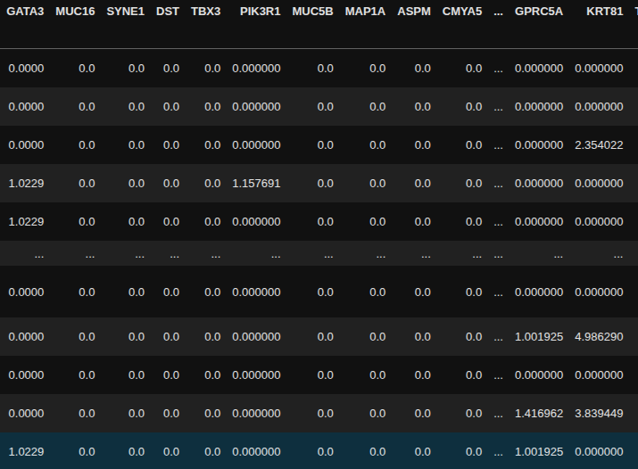
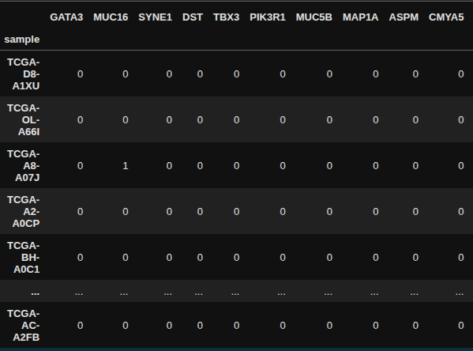
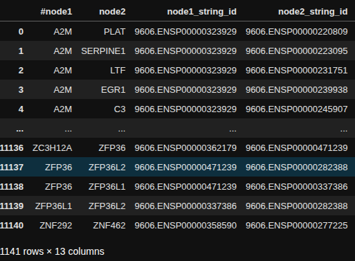

# CGGA-CMNDT
In this project, a Genetic Algorithm combined with the Common Global Optimum operator is proposed for solving the CMNDT model (CGGA-CMNDT). The algorithm name CGGA stands for Common Global Optimum Genetic Algorithm, and the model name CMNDT represents the four integrated biological properties: Coverage, Mutual exclusivity, Network connectivity, and Single-Cell cell-type Differential Expression. The input consists of a binary somatic mutation matrix S, a cell-type differential expression matrix D derived from single-cell RNA-seq data, a connected PPI network Q, and a parameter K specifying the number of genes in the driver pathway. The output is the optimal set of K genes, which corresponds to a submatrix A extracted from S and a submatrix A' extracted from D that together maximize a weighted objective function based on the four biological properties. 

# Operating System
Ubuntu 20.04, and all algorithms were implemented in Python 3.10.8

# Input Data: A Single-Cell cell-type Differential Expression Matrix D

# Input Data: A Somatic Mutation Matrix S

# Input Data: A PPI network Q

# Output: A set of genes related to the output submatrix A and A', and its corresponding fitness score
Individual Index(['B2M', 'IL6', 'SERPINA1', 'AREG', 'GDF15'], dtype='object') converges on fitness: 1.6500348769320714 ...
# Steps for the experiment:
1. Installs the packages of the environment
   ```bash
   pip install -r requirements.txt
2. Sets the required parameters before starting the experiment
   ```python
   ELITE_SIZE=200;
   MUTATION_RATE=0.6;
   CROSSOVER_PROB=0.7;
   POPULATION_SIZE = 1000;
   MAX_GEN = 1000;
3. Running the experiment for the corresponding K value setting
   ```python
    K = 2;
   
    best_fitness_val, best_sol, fitness_obs = genetic_algorithm(
      fitness_fn=fitness_fn, 
      population_size=POPULATION_SIZE, chromosome_total_length=tumor_mut_bin.shape[1], chromosome_length=K,
      elite_size=ELITE_SIZE, mutation_rate=MUTATION_RATE, crossover_probability=CROSSOVER_PROB, 
      tumor_mut_bin = tumor_mut_bin,
      gname_list = tumor_mut_bin.columns,
      max_generations=MAX_GEN, fitness_max_min_type="max",
      global_env = globals(),
   )
# Link for downloading data
link: https://pan.baidu.com/s/1tJ1bS3lfoelsjUuPWubbzA?pwd=spth <br>
retrieve code: spth 

